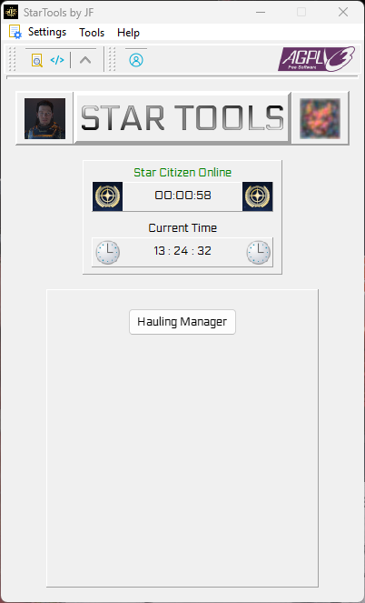
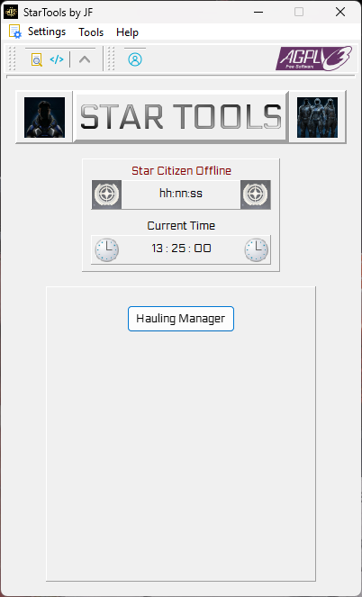
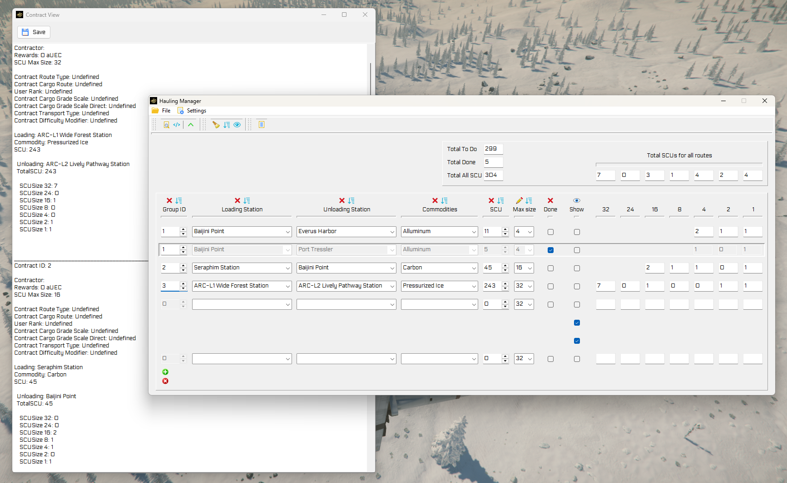

[](https://www.gnu.org/licenses/agpl-3.0)
[](https://github.com/JoeFerri/StarTools/issues)
[](code_of_conduct-eng.md)


# 👨‍🚀 StarTools 👩‍🚀

**StarTools** is a collection of utilities designed to enhance the Quality of Life (QoL) for players in **Star Citizen**.

The project is built with a **non-intrusive philosophy**: StarTools does not read the game's memory or cache, nor does it modify game executables or any other internal files. It operates as a completely external assistant, ensuring full compatibility with the game's Terms of Service.

<p align="center">
  <a href="https://github.com/JoeFerri/StarTools/releases/latest">
    
  </a>
</p>

<p align="center">
  <a href="https://github.com/JoeFerri/StarTools/releases/download/v1.1.0-alpha/StarTools_v1.1.0-alpha-Release.zip">
    
  </a>
  &nbsp;&nbsp;&nbsp;
  <a href="https://github.com/JoeFerri/StarTools/releases/download/v1.1.0-alpha/StarTools_v1.1.0-alpha-Debug.zip">
    
  </a>
</p>
<p align="center">
  <a href="#ignore">
    
  </a>
  <br>
  <a href="#ignore">
    
  </a>
</p>

## ✨ Features

The application features a main dashboard where users can access various specialized tools. Currently, the following module is implemented:

* **Hauling Manager:** A comprehensive tool to organize logistics and transport.
    * Manages multiple routes using a modular panel system.
    * Supports GroupIDs to link multiple legs of a journey to a single mission or contract, while allowing generic routes for maximum flexibility.
    * Provides a detailed breakdown of total **SCU**, categorized by container size (32, 24, 16, 8, 4, 2, 1).
    * Includes basic sorting options for better cargo organization.
    * Supports data saving for active contracts.

More tools are currently under development and will be added to the main dashboard in future updates.

## ⚖️ Legal Disclaimer

**StarTools** is a fan-made, non-profit software developed by a player for the community.

* All trademarks, service marks, and software names mentioned (including Star Citizen, Cloud Imperium Games, and Roberts Space Industries) are the property of their respective owners.
* This project is not endorsed by or affiliated with Cloud Imperium Rights LLC or Cloud Imperium Rights Ltd.

---

## 📡 Data Sources
⚠️ In no way have the game's executable files been examined and/or manipulated for the design and development of StarTools.

---

## 📖 Documentation

### 🛠️ Technical Documentation

For developers and contributors, the API reference generated from the source code is available here:
* **[StarTools Online Documentation](https://joeferri.github.io/StarTools/)**

### ⏳ User Guides (Coming Soon)
I am currently working on comprehensive guides to help players get the most out of StarTools:
* 🎬 **Video Tutorial:** A step-by-step walkthrough of the main features (to be hosted on YouTube).
* 📄 **PDF User Manual:** A downloadable, detailed guide covering all tools and shortcuts.

*Stay tuned for updates in the upcoming releases!*

### Main Dashboard

#### 👤 Personal avatar and organization logos with game status tracking
[](images/StarTools_Main-Online.png)

#### 🛸 Default logos and game idle state
[](images/StarTools_Main-Offline.png)

#### 📦 Loading/unloading contract and route management tools
[](images/StarTools_Hauling_Manager-ContractView.png)

---

## 📥 Installation

**StarTools** is currently available as a standalone portable application. You don't need to run an installer.

1. Navigate to the **[Releases](https://github.com/JoeFerri/StarTools/releases)** page.
2. Download the `.zip` package that best suits your needs:

|          Package               | Intended Audience |                               Description                             |
|            :---                |        :---       |                                    :---                               |
| **startools_vX.X-release.zip** | **Players**       | Optimized for performance, smaller file size, best for daily use.     |
| **startools_vX.X-debug.zip**   | **Developers**    | Includes debug symbols and verbose logging to help track down issues. |

3. Extract the ZIP file to your preferred folder.
4. Run `StarTools.exe` to launch the application.

> [!IMPORTANT]
> **Windows SmartScreen:** Since this is a fan-made project without a digital signature, Windows may flag the executable. If prompted, click **"More info"** and then **"Run anyway"**.

---

## 🗺️ Main RoadMap - tasks completed

- [x] MVP (Minimum Viable Product) code implementation

for the full roadmap see [roadmap.md](roadmap.md)

---

## 🏗️ Compilation

This project is specifically designed for **Windows**, as Star Citizen is a Windows-only application.

### 📋 Prerequisites

To compile StarTools, you need to have the following tools installed on your system:

* **IDE:** [Lazarus 4.4](https://www.lazarus-ide.org/)
* **Compiler:** [Free Pascal 3.2.2](https://www.freepascal.org/)
* **Documentation Tools:** [PasDoc](https://pasdoc.github.io/) and [Graphviz](https://graphviz.org/) (required only if you want to generate the documentation via Makefile).
* **Environment:** [WSL2 (Ubuntu)](https://learn.microsoft.com/en-us/windows/wsl/install) is required to run the provided `Makefile` on Windows 11.

### 👣 Step-by-Step Instructions

#### 1. Clone the Repository
Start by cloning this repository to your local machine:
```bash
git clone https://github.com/JoeFerri/StarTools.git
cd StarTools
```

#### 2. Install External Dependencies
StarTools depends on the [**jflibfp**](https://github.com/JoeFerri/jflibfp) library. This library is maintained in a separate repository and is under a different license.

Download the latest source code from the **jflibfp** repository.

Create the directory `project/libs/` if it doesn't exist.

Place the **jflibfp** folder inside `project/libs/`.

The structure should look like this: `StarTools/project/libs/jflibfp/`

#### 3. Build with Lazarus
Open Lazarus IDE.

Go to `Project -> Open Project` and select the `.lpi` file inside the `project/` folder.

Ensure the paths to **jflibfp** are correctly set in `Project Options -> Compiler Options -> Paths`.

Press `F9` (or `Run -> Build`) to compile the executable.

#### 4. Generate Documentation
If you are using **WSL2** and have **PasDoc**/**Graphviz** installed, you can regenerate the technical documentation:

Open your **WSL2** terminal.

Navigate to the root folder of the project.

Run the following command:

```bash
make full-doc
```

This will generate the HTML documentation and the Graphviz class/use diagrams inside the `docs/` folder.

#### 5. Create Distribution Packages

> [!WARNING]
> **Prerequisite for Step 5:**
>
> Before running the command, ensure that you have already built the project in Lazarus for both **Release** and **Debug** modes. The process expects the following files to exist:
> * `project/startools-release.exe`
> * `project/startools-debug.exe`

Once the application has been compiled via Lazarus, you can use the **WSL2** terminal to automatically package the release and debug versions into ZIP files:

1. Open your **WSL2** terminal.
2. Ensure you are in the project root folder.
3. Run the following command:

    ```bash
    make dist
    ```

This command will:
- Automatically detect the version number from the `.lpi` project file.
- Create a `bin/` folder.
- Package the executables along with the `data/` and `saves/` folders.
- Include essential files such as `README.md`, `LICENSE`, and `CHANGELOG.md`.
The resulting files (e.g., `StarTools_v1.2.3-Release.zip`, `StarTools_v1.2.3-Debug.zip`) will be ready for distribution inside the `bin/` directory.

---

### 🤝 Code of conduct

[ENG](code_of_conduct-eng.md)

[ITA](code_of_conduct-ita.md)

---

## 💡 Contribution Guidelines

[Contribution Guidelines](https://github.com/JoeFerri/StarTools/CONTRIBUTING.md)

---

# 📜 License

## 📑 Third-Party Intellectual Property (IP)

All **game content, assets, and materials** are copyright of **Cloud Imperium Rights LLC** and **Cloud Imperium Rights Ltd**. **Star Citizen®**, **Squadron 42®**, **[Roberts Space Industries](https://robertsspaceindustries.com/en/)®**, and **[Cloud Imperium](https://cloudimperiumgames.com/)®** are registered trademarks of Cloud Imperium Rights LLC. All such materials are used here under "Fair Use" or the specific "Fandom/Fan Content" guidelines provided by the developer.

## ⚖️ Software License (AGPL-3.0)

**Only the source code** of this program is owned by the author and licensed under the terms of the **GNU Affero General Public License** as published by the Free Software Foundation, either version 3 of the License, or (at your option) any later version. Game assets, trademarks, and third-party materials mentioned above are expressly excluded from this license.

### 🔓 AGPL-3.0 license 

Copyright (c) 2025 Giuseppe Ferri

This program is free software: you can redistribute it and/or modify
it under the terms of the GNU Affero General Public License as
published by the Free Software Foundation, either version 3 of the
License, or (at your option) any later version.

This program is distributed in the hope that it will be useful,
but WITHOUT ANY WARRANTY; without even the implied warranty of
MERCHANTABILITY or FITNESS FOR A PARTICULAR PURPOSE.  See the
GNU Affero General Public License for more details.

You should have received a copy of the GNU Affero General Public License
along with this program.  If not, see <https://www.gnu.org/licenses/>.
